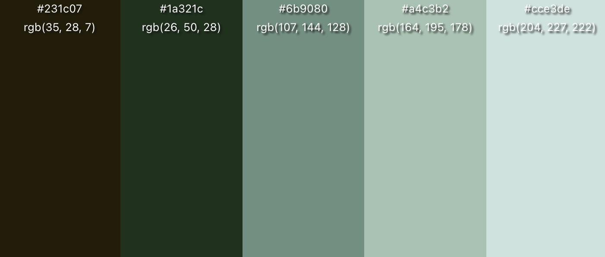
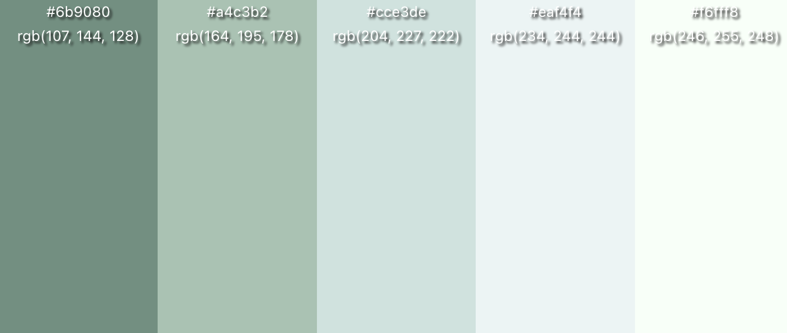
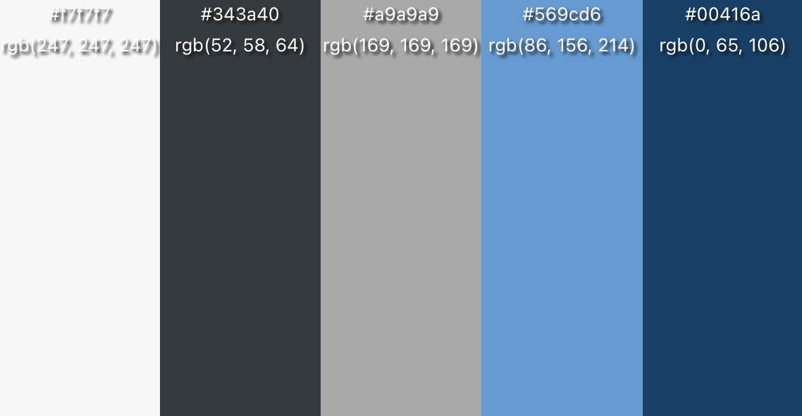
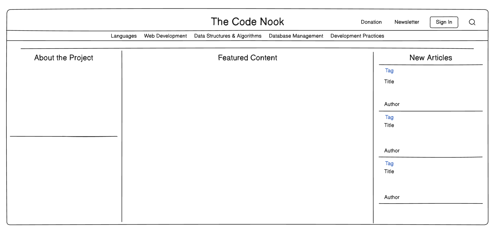
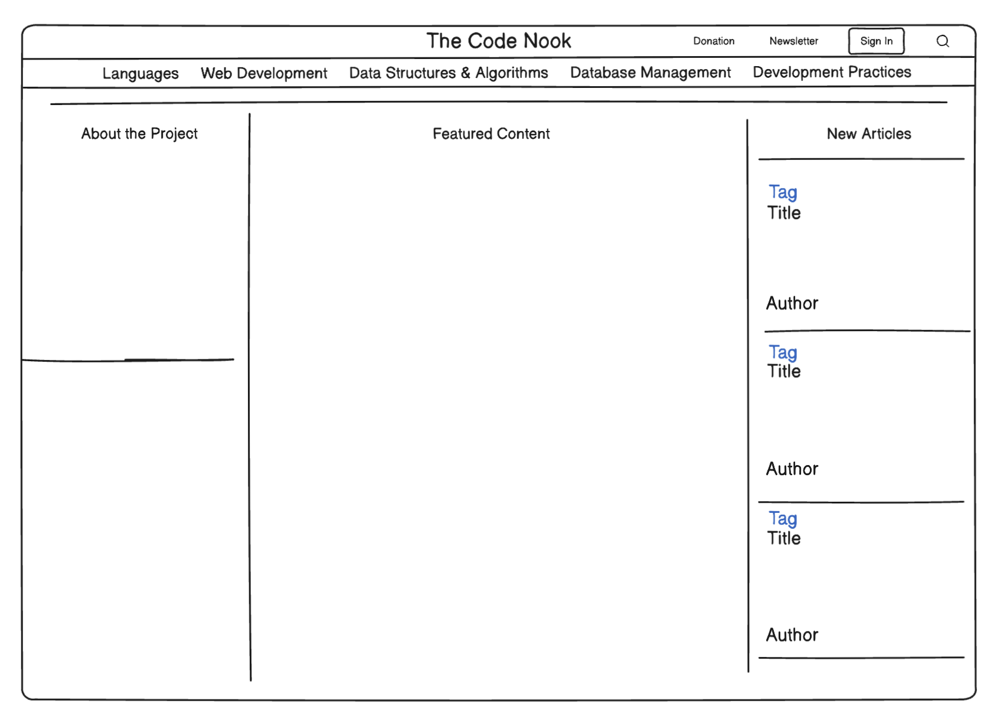
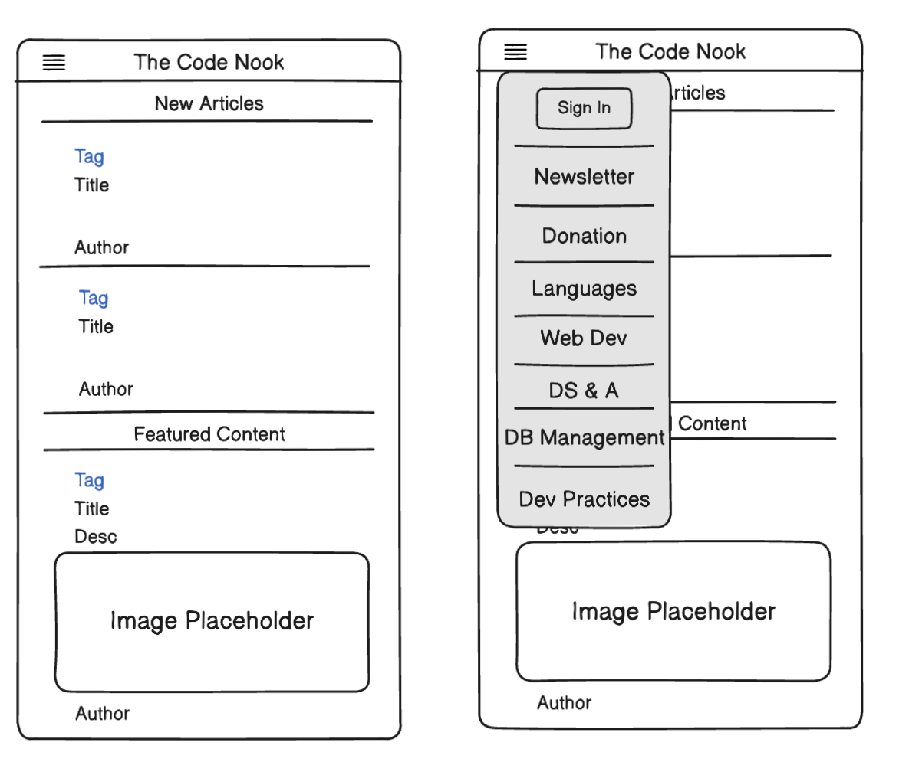

# Design Documentation

_Last Updated : 7/17/2023_

## Introduction

**Status** : `Development`

My goal is to create the one stop shop for _Developers_ to discuss `projects`, `ideas`, `questions`, `code`, and more with ease and reliability

## Color Scheme

<pre>
1. Darkest: Background or header
2. Dark: Text or secondary elements
3. Mid: Primary content background
4. Light: Buttons or accents
5. Lightest: Highlights or borders
</pre>

**Dark Mode**

- 231c07, 1a321c, 6b9080, a4c3b2, cce3de

**Light Mode**

- 6B9080, A4C3B2, CCE3DE, EAF4F4, F6FFF8

**Minimal Blue**

### Wide View

### Medium View

### Mobile View

> Created and developed by Michael Farabough
