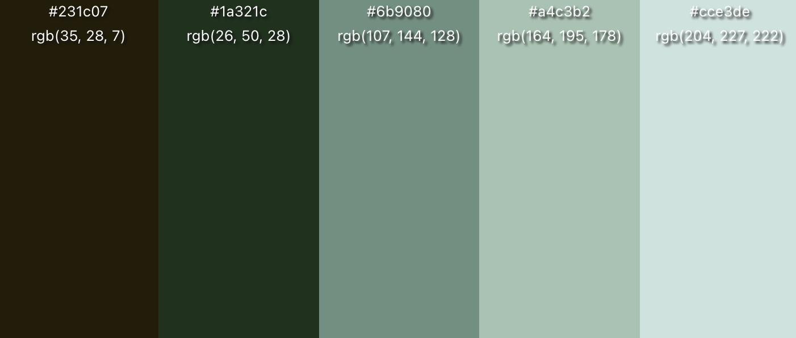

# Design Documentation

_Last Updated : 7/17/2023_

## Introduction

**Status** : `Development`

My goal is to create the one stop shop for _Developers_ to discuss `projects`, `ideas`, `questions`, `code`, and more with ease and reliability

## Color Scheme

**Dark Mode**

- 231c07, 1a321c, 6b9080, a4c3b2, cce3de

**Light Mode**

- 6B9080, A4C3B2, CCE3DE, EAF4F4, F6FFF8

> Created and developed by Michael Farabough
